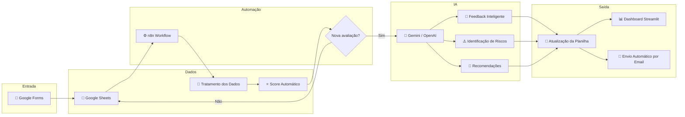
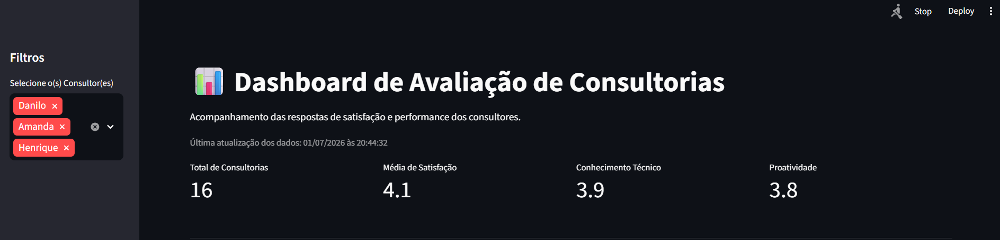
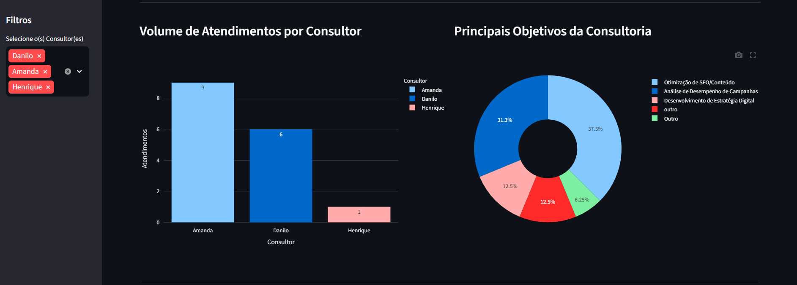
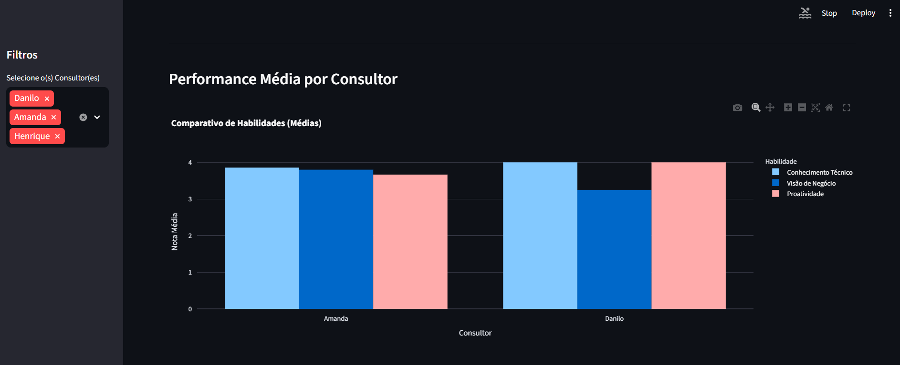
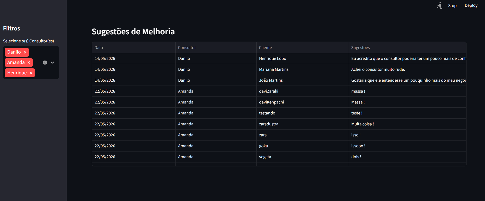
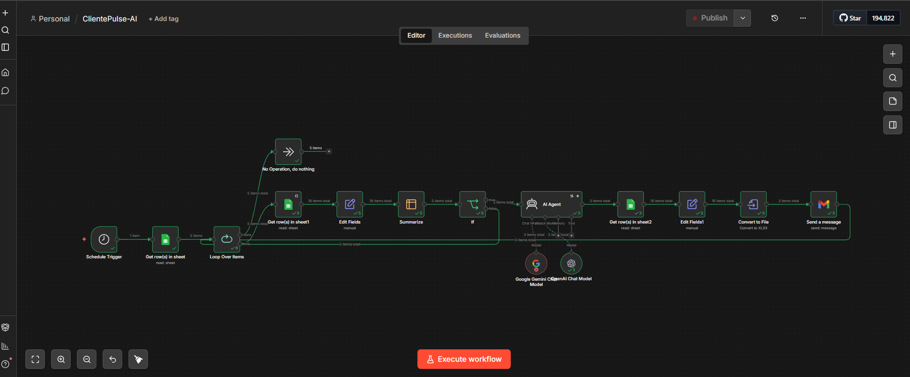
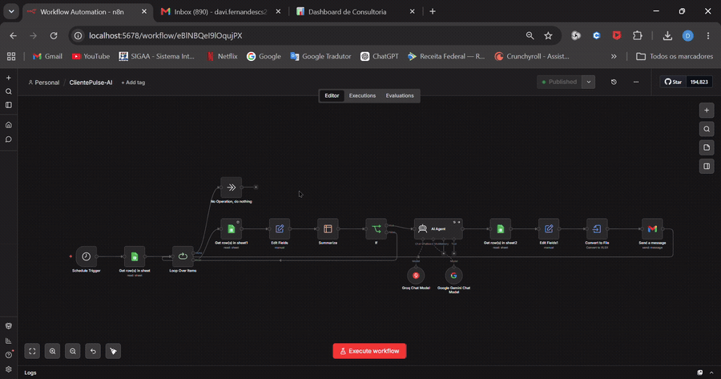
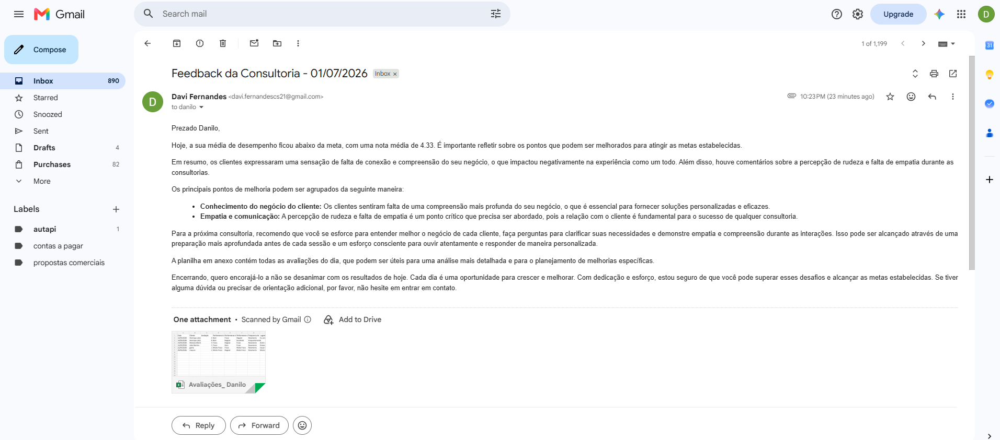
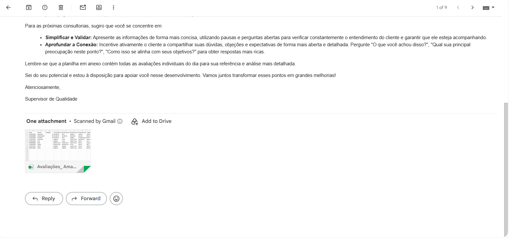

Python 3.12 | Streamlit | Gemini | OpenAI | n8n | Google Sheets | License MIT
# 🚀 ClientPulse-AI

Sistema inteligente de análise de feedbacks para consultorias utilizando **Inteligência Artificial Generativa**, automação de processos e dashboards em tempo real.

O projeto automatiza todo o ciclo de avaliação do cliente, desde a coleta dos dados até a geração de insights estratégicos e envio automático de relatórios.

---

# 📌 Problema

Consultorias recebem diversas avaliações diariamente. Em muitos casos, a análise dessas respostas é realizada manualmente, consumindo tempo e dificultando a identificação rápida de problemas e oportunidades de melhoria.

Além disso, consolidar indicadores, gerar feedbacks personalizados e acompanhar a evolução dos consultores exige um processo operacional complexo.

---

# 💡 Solução

O ClientPulse-AI automatiza completamente esse fluxo.

O sistema:

- 📥 Coleta respostas automaticamente pelo Google Forms
- 📊 Atualiza a base de dados em tempo real
- 🧹 Trata e padroniza os dados
- ⭐ Calcula automaticamente o Score de Satisfação
- 🤖 Utiliza IA Generativa para produzir feedbacks personalizados
- ⚠️ Identifica riscos e oportunidades
- 📈 Atualiza um Dashboard Inteligente
- 📧 Envia automaticamente relatórios por e-mail

---

# 🏗 Arquitetura do Sistema



---

# ⚙️ Pipeline da Aplicação

```text
Cliente responde o formulário

↓

Google Forms registra a avaliação

↓

Google Sheets recebe os dados

↓

Workflow do n8n inicia automaticamente

↓

Tratamento e limpeza dos dados

↓

Cálculo automático do Score

↓

IA analisa todo o contexto

↓

Feedback personalizado

↓

Atualização da planilha

↓

Dashboard atualizado automaticamente

↓

Envio do relatório por e-mail
```

---

# 🛠 Tecnologias Utilizadas

- Python
- Streamlit
- n8n
- Google Sheets API
- Pandas
- OpenAI API
- Google Gemini
- Gmail API

---

# 📊 Funcionalidades

## Dashboard Inteligente

- Ranking automático de consultores
- Média de satisfação
- Score geral
- Atualização automática
- Filtros por consultor
- KPIs
- Gráficos interativos

---

## Inteligência Artificial

- Feedback personalizado
- Identificação automática de riscos
- Recomendações inteligentes
- Resumo das avaliações

---

## Automação

- Atualização automática da planilha
- Processamento sem intervenção humana
- Geração automática de relatórios
- Envio automático de e-mails

---

# 📸 Demonstração

## 📊 Dashboard Geral



---

## 📈 Volume de Atendimentos por Consultor e Principais Objetivos da Consultoria



---

## ⭐ Performance Média



---

## 💡 Sugestões de Melhoria



---

## ⚙ Workflow n8n

Workflow responsável pela automação completa do processo de coleta, análise e geração dos feedbacks utilizando IA Generativa.



---

## 🎥 Demonstração



---

## 📧 Relatório Automático

Após a análise dos dados, o sistema envia automaticamente um relatório personalizado por e-mail.




# 📈 Resultados 

✅ Redução do trabalho manual

✅ Processamento automático das avaliações

✅ Feedbacks personalizados utilizando IA

✅ Atualização automática do Dashboard

✅ Identificação rápida de riscos

✅ Envio automático de relatórios

---

# 🚀 Como executar

Clone o repositório

```bash
git clone https://github.com/DaviSantos-23/ClientPulse-AI.git
```

Entre na pasta

```bash
cd ClientPulse-AI
```

Instale as dependências

```bash
pip install -r requirements.txt
```

Execute a aplicação

```bash
streamlit run app.py
```

# 👨‍💻 Autor

## Davi Santos

🎓 Ciência da Computação — UFS

**Python • IA Generativa • Automação • Ciência de Dados • n8n • Streamlit**

---

⭐ Se este projeto foi útil, deixe uma estrela no repositório.
